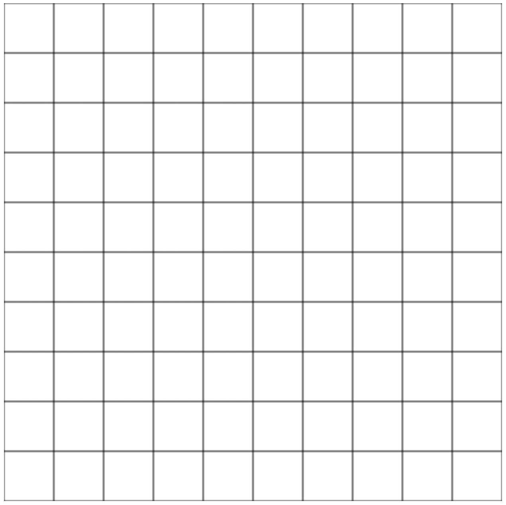

# LAB | Canvas Treasure Hunt

## Introduction

In this Lab, we'll implement a simple treasure hunt game.

You can find a demo for what we'll be building [here](https://ironhack-dev-squad-127.github.io/lab-canvas-treasure-hunt/solution-code/).

## Requirements

- Fork this repo
- Clone this repo

## Submission

- Upon completion, run the following commands:

  ```
  git add .
  git commit -m "done"
  git push origin master
  ```

- Create Pull Request so your TAs can check up your work.

## Iteration 1: Drawing the Grid

The goal is to reproduce the following grid.



For this, you will need to create a file `index.html` with the following code:

```html
<!DOCTYPE html>
<html lang="en">
  <head>
    <meta charset="UTF-8" />
    <meta name="viewport" content="width=device-width, initial-scale=1.0" />
    <meta http-equiv="X-UA-Compatible" content="ie=edge" />
    <title>JS | Canvas Treasure Hunt</title>
    <link rel="stylesheet" href="style.css" />
  </head>
  <body>
    <canvas width="500" height="500"></canvas>
    <script src="main.js"></script>
  </body>
</html>
```

You will also have to create a file `main.js` like the following one:

```js
// main.js
const canvas = document.querySelector('canvas');
const context = canvas.getContext('2d');

const width = canvas.width;
const height = canvas.height;

// Iteration 1
function drawGrid() {
  // TODO: write the code of the function
}

function drawEverything() {
  drawGrid();
  // drawPlayer()
  // drawTreasure()
}

drawEverything();
```

To finish this iteration, you have to code the function `drawGrid`.

## Iteration 2: The Character Class

Now, you have to create a class `Character`. You should define at least:

- `col` property
- `row` property
- `moveUp()` method
- `moveRight()` method
- `moveDown()` method
- `moveLeft()` method

Below, we have an example of the expected outcome.

```js
const player = new Character(0, 0); // (0,0) = Initial position

player.moveDown(); // Increase by 1 the value of player.row
player.moveDown(); // Increase by 1 the value of player.row
player.moveRight(); // Increase by 1 the value of player.col

console.log(player.col, player.row); // => 1,2
```

## Iteration 3: Drawing the Player

Create a function `drawPlayer` that displays the `player` on the canvas based on its `col` and `row` values.

You can simply rely on `images/character-down.png` for this iteration.

## Iteration 4: The Treasure Class

- Create a class `Treasure` with a method `setRandomPosition()` and a property `col` and `row`
- Create a function `drawTreasure()` that displays the treasure on the canvas. The picture is `images/treasure.png`

## Iteration 5: React to player input

Listen for `keydown` events to:

- Update the player's coordinates.
- Draw everything again by calling `drawEverything()`.

For this, you take inspiration from the following code.

```js
window.addEventListener('keydown', (event) => {
  // Stop the default behavior (moving the screen to the left/up/right/down)
  event.preventDefault();

  // React based on the key pressed
  switch (event.keyCode) {
    case 37:
      console.log('left');
      break;
    case 38:
      console.log('up');
      break;
    case 39:
      console.log('right');
      break;
    case 40:
      console.log('down');
      break;
  }
};
```

## Bonus: Iteration 6

Do what you want to make this game awesome!

Here are some ideas:

- Add a property `direction` to the player and display a different image based on the direction.
- Stop the player at the edges of the board.
- Add another player that can be controlled with different keys (WASD).
- Add a `score` property to the player and create a function `drawScores`.

**Happy coding! 💙**
